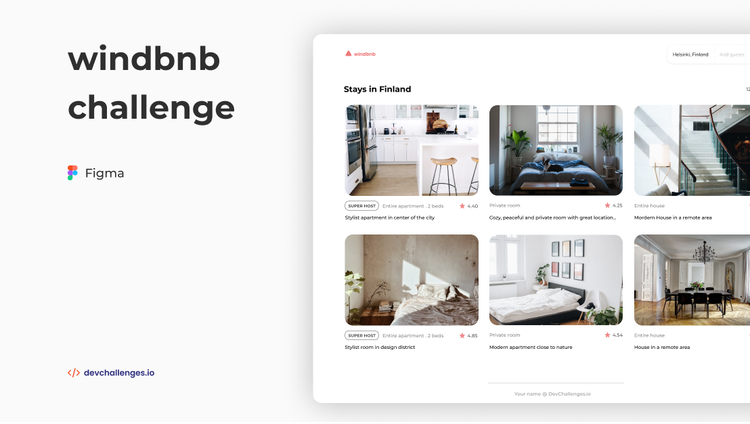

**Windbnb, une petite version de Airbnb, responsive et `mobile first`**, développé en `HTML`, `CSS`, et `JavaScript`.

Les données proviennent d'un fichier `json`. Je travaille avec ce fichier exactement comme un `API`. 

Vous pouvez visiter le site en cliquant sur l'image ci-dessous ou sur le lien en bas de la section `About`.

`Données et design récupérés chez devchallenge.io, tous droits réservés !`

<a href = "https://yousoumar.github.io/js-windbnb"></img></a>

  

